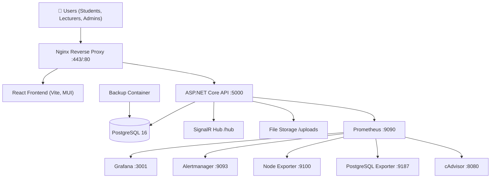

# School Management System

A production-ready, full-stack School Management System built with a **Clean Architecture** .NET backend and a **React (Vite/TypeScript)** frontend. It provides comprehensive academic management — student and lecturer registration, enrollment, course offerings, grading, assessments, accommodation, certificates, reporting, notifications, and robust infrastructure observability — all containerized with Docker and monitored with Prometheus/Grafana.

---

## Table of Contents

- [Overview](#overview)
- [Technology Stack](#technology-stack)
- [Architecture](#architecture)
- [Features](#features)
- [Roles and Permissions](#roles-and-permissions)
- [Project Structure](#project-structure)
- [Local Development](#local-development)
- [Docker Deployment](#docker-deployment)
- [Initial Administrator Creation](#initial-administrator-creation)
- [Database Management](#database-management)
- [Configuration](#configuration)
- [API](#api)
- [Monitoring](#monitoring)
- [Backup and Restore](#backup-and-restore)
- [Testing](#testing)
- [Security](#security)
- [Troubleshooting](#troubleshooting)
- [Production Status](#production-status)
- [Documentation](#documentation)
- [License](#license)

---

## Overview

The School Management System (SMS) is an integrated platform that digitizes the core academic and administrative operations of an educational institution. It connects **students**, **lecturers**, **coordinators**, **administrators**, and **reception staff** through a single web application.

The system handles the full academic life cycle:

- Student registration and approval.
- Course and unit setup.
- Course offerings, unit allocation, and lecturer assignment.
- Student enrollment and confirmation.
- Assignment, assessment, and grading workflows.
- Accommodation allocation (houses and lanes).
- Certificate generation and verification (QR + watermark).
- Report generation and authentication.
- In-app notifications (SignalR).
- Centralized logging, structured health checks, and infrastructure monitoring.

---

## Technology Stack

### Backend
| Technology | Purpose |
|------------|---------|
| **.NET (C#)** | Backend runtime |
| **ASP.NET Core Web API** | REST API + SignalR hub |
| **Entity Framework Core** | ORM (PostgreSQL provider) |
| **ASP.NET Core Identity** | User/role management, password policy, lockout |
| **JWT (HS256)** | Access token authentication |
| **Serilog** | Structured JSON/text logging |
| **FluentValidation** | Command validation (via `SMS.Application`) |

### Frontend
| Technology | Purpose |
|------------|---------|
| **React 19** | UI framework |
| **Vite** | Build tool / dev server |
| **TypeScript** | Typed JavaScript |
| **MUI (Material UI) 5** | Component library |
| **TanStack Query** | Server-state management |
| **Axios** | HTTP client |
| **React Hook Form + Zod** | Forms + validation |
| **FullCalendar** | Calendar / timetables |
| **Vitest + Testing Library** | Unit/component tests |

### Infrastructure
| Technology | Version | Purpose |
|------------|---------|---------|
| **PostgreSQL** | 16-alpine | Primary database |
| **Nginx** | 1.27-alpine | Reverse proxy / TLS termination |
| **Prometheus** | v2.54.1 | Metrics collection |
| **Grafana** | 11.2.0 | Dashboards / visualization |
| **Alertmanager** | v0.27.0 | Alert routing |
| **Node Exporter** | v1.8.2 | Host-level metrics |
| **PostgreSQL Exporter** | v0.15.0 | Database metrics |
| **cAdvisor** | v0.49.1 | Container metrics |
| **Docker / Docker Compose** | — | Containerization & orchestration |

> **Note:** SMTP/email is **disabled** by design. Password resets are **admin-mediated** — an administrator approves and fulfills password reset requests in-app. There is no Twilio/SMS integration in this repository.

---

## Architecture

The backend follows a **Clean Architecture** style with clear separation of concerns across projects:

- **SMS.Domain** — Core entities, enums, and repository interfaces (no dependencies).
- **SMS.Application** — CQRS commands/queries, DTOs, validation, and application services.
- **SMS.Infrastructure** — File storage, audit, reporting auth, multi-tenancy, token revocation, and service implementations.
- **SMS.Persistence** — EF Core `DbContext`, migrations, and repository implementations.
- **SMS.Identity** — JWT service and authorization helpers.
- **SMS.API** — Controllers, middleware, health checks, and startup configuration.
- **SMS.Certificates** — Certificate generation, templates, eligibility, verification, and PDF generation.
- **SMS.Reporting** — Report generation (QuestPDF/EPPlus), report authentication, watermarking.
- **SMS.Notifications** — SignalR `NotificationHub` and in-app notification services.
- **SMS.Multitenancy** — Tenant context resolution and tenant filtering.

### Architectural Patterns
- **CQRS** — commands and queries are separate classes with their own handlers.
- **Repository Pattern** — data access abstracted behind interfaces.
- **Unit of Work** — transactional coordination across repositories.
- **Dependency Injection** — all services registered in `SMS.API/Program.cs`.
- **Multi-tenancy** — tenant-aware `DbContext` with automatic tenant filtering.
- **REST API** — versioned controllers under `/api/v1`.

### Architecture Diagram



---

## Features

### Authentication & Security
- JWT access tokens (HS256) with refresh token rotation and hashing.
- Access token revocation (in-memory in dev; **Redis-backed in production** when `RedisTokenRevocation:ConnectionString` is configured).
- Account lockout after 5 failed attempts (15-minute lockout).
- Password policy: min 12 characters, digit, uppercase, lowercase, non-alphanumeric, 4 unique chars.
- Server-side password strength / entropy validation (`PasswordPolicyService`).
- CSRF protection via double-submit cookie middleware.
- Rate limiting (default 20 requests/min per client; configurable).
- Security headers middleware (HSTS, X-Content-Type-Options, etc.).
- CORS restricted to the configured frontend origin.
- Tenant isolation with server-enforced tenant filters.
- Structured audit logging of security-relevant actions.
- File upload validation (allowed extensions, 10 MB max, XSS-nosniff on served uploads).

### User & Role Management
Six roles are seeded automatically (see [Roles and Permissions](#roles-and-permissions)). Administrators can approve/reject registrations, reset passwords, and manage users. Self-registration is supported for students and lecturers with admin approval workflow.

### Academic Management
- **Courses & Units** — CRUD, units linked to courses.
- **Lecturers & Students** — profiles, titles, and automatic username generation.
- **Unit Allocation** — allocate units to lecturers.
- **Enrollment** — self-enrollment, bulk enroll, approval workflow, drop enrollment.
- **Course Offerings** — create offerings, assign students/lecturers, confirm enrollment/teaching, report assignment issues.
- **Assignments & Attendance** — tracking and management.
- **Grades** — create/update grades, grade bands, transcripts, grade export, moderation.
- **Assessments** — assessment types, templates, exemptions, results, moderation workflow, publication status.
- **Timetables & Calendar** — scheduling via FullCalendar.

### Accommodation
- Houses and lanes management.
- Availability tracking and maintenance/unavailability states.
- Student/lecturer allocation with assignment, transfer, and vacate workflows.
- Occupancy reports and dashboard statistics.

### Reports & Certificates
- Report generation (PDF) with **watermarking**.
- Report verification via **QR code + token + hash**.
- Certificate templates, eligibility rules, automatic certificate generation, and bulk issuance.
- Certificate verification page (public) and QR-scannable verification endpoint.

### Notifications
- In-app notifications delivered via **SignalR** (`/hub`).
- Notifications for registration, enrollment, offerings, and other workflow events.

---

## Roles and Permissions

| Role | Main Responsibilities |
|------|-----------------------|
| **SYSTEM ADMINISTRATOR** | Super administrator with unrestricted system access. Seeded as the initial admin user. |
| **Administrator** | Full system access with all permissions: user management, approvals, configuration, reports. |
| **COORDINATOR** | Elevated access for content and user management — course offerings, enrollment coordination, approvals. |
| **Lecturer** | Teaching staff — view assigned units, record grades/assessments, manage assignments & attendance. |
| **Student** | Self-enrollment, view courses/grades/certificates, accommodation requests, notifications. |
| **Receptionist** | Front desk access — registration support, accommodation allocation, inquiries. |

Authorization policies are defined in `SMS.API/Program.cs`:

| Policy | Roles |
|--------|-------|
| `AdministratorAccess` | `Administrator` |
| `ModeratorAccess` | `Administrator`, `COORDINATOR` |
| `LecturerAccess` | `Administrator`, `COORDINATOR`, `Lecturer` |
| `StudentAccess` | `Administrator`, `COORDINATOR`, `Lecturer`, `Student` |
| `ReceptionistAccess` | `Administrator`, `COORDINATOR`, `Receptionist` |

---

## Project Structure

```text
SchoolManagementSystem/
├── src/
│   ├── SMS.API/               # Web API, middleware, controllers, health checks
│   ├── SMS.Application/       # CQRS, DTOs, validation, application services
│   ├── SMS.Domain/            # Entities, enums, repository interfaces
│   ├── SMS.Infrastructure/    # File storage, audit, multi-tenancy, services
│   ├── SMS.Persistence/       # EF Core DbContext, migrations, repositories
│   ├── SMS.Identity/          # JWT service, identity helpers
│   ├── SMS.Certificates/      # Certificate generation & verification
│   ├── SMS.Reporting/         # Report generation, watermark, verification
│   ├── SMS.Notifications/     # SignalR hub + notification services
│   ├── SMS.Multitenancy/      # Tenant context and resolution
│   └── SMS.Shared/            # Shared infrastructure
├── frontend/
│   └── sms-web/               # React + Vite + TypeScript frontend
├── tests/
│   ├── SMS.ApiTests/          # API integration tests
│   ├── SMS.IntegrationTests/  # Database integration tests
│   └── SMS.UnitTests/         # Unit tests
├── docker/
│   ├── docker-compose.yml     # Base compose (dev)
│   ├── docker-compose.prod.yml# Production compose
│   ├── docker-compose.override.yml
│   ├── Dockerfile.api
│   ├── Dockerfile.frontend
│   ├── Dockerfile.backup
│   ├── nginx.conf             # Production reverse proxy config
│   ├── nginx-frontend.conf
│   ├── prometheus.yml
│   ├── prometheus-alerts.yml
│   ├── alertmanager.yml
│   ├── grafana-dashboards/
│   ├── grafana-datasources/
│   └── init-db.sql
├── scripts/                   # Deploy, backup, restore, seed, health-check
├── Documentation/             # Full technical documentation set
├── README.md
├── .env.example
├── .gitignore
└── SchoolManagementSystem.sln
```

---

## Local Development

### Prerequisites
- **Git**
- **.NET SDK 8** (or the version pinned in `global.json`)
- **Node.js** (18+ recommended)
- **npm**
- **Docker** + **Docker Compose** (for PostgreSQL or full-stack local run)

### Clone

```bash
git clone https://github.com/hudson254/SchoolManagementSystem.git
cd SchoolManagementSystem
```

### Configure Environment

1. Copy `.env.example` to `.env` and fill in **strong** values:

```bash
cp .env.example .env
```

2. At minimum, set:
   - `DB_PASSWORD` — PostgreSQL password.
   - `JWT_SECRET` — a strong, randomly generated secret (e.g., 64+ chars).
   - `ADMIN_EMAIL`, `ADMIN_PASSWORD` — initial administrator credentials.

### Run the Database

```bash
docker compose -f docker/docker-compose.dev.yml up -d postgres
```

### Run the Backend

```bash
dotnet restore
dotnet run --project src/SMS.API
```

The API listens on `http://localhost:5000` (dev profile). Swagger is **disabled by default** — enable with `Swagger__Enabled=true` (dev only).

### Run the Frontend

```bash
cd frontend/sms-web
npm install
npm run dev
```

The frontend dev server runs at `http://localhost:5173` and proxies API requests to the backend.

### Initial Data

Migrations run automatically at startup. To explicitly migrate and seed:

```bash
dotnet run --project src/SMS.API -- migrate-database
dotnet run --project src/SMS.API -- seed-data
```

---

## Docker Deployment

### 1. Prepare Environment

```bash
cp .env.example .env
# Edit .env — set strong DB_PASSWORD, JWT_SECRET, ADMIN_EMAIL, ADMIN_PASSWORD, GRAFANA_PASSWORD
```

### 2. Validate & Start

```bash
docker compose -f docker/docker-compose.prod.yml config
docker compose -f docker/docker-compose.prod.yml build
docker compose -f docker/docker-compose.prod.yml up -d
```

### 3. Verify

```bash
docker compose -f docker/docker-compose.prod.yml ps
curl -s http://localhost:5000/health
```

### Production Containers

| Container | Purpose | Host Port |
|-----------|---------|-----------|
| `nginx` | Reverse proxy + TLS termination (frontend + API) | 80, 443 |
| `frontend` | React static bundle served by Nginx | 3000 |
| `api` | ASP.NET Core API (HTTP-only, behind nginx) | 5000 |
| `postgres` | PostgreSQL 16 database | 5433 (host) → 5432 |
| `backup` | Automated pg_dump backups | — |
| `prometheus` | Metrics collection (scrapes API, exporters) | 9090 |
| `grafana` | Dashboards (auto-provisioned) | 3001 |
| `alertmanager` | Alert routing | 9093 |
| `node-exporter` | Host CPU/memory/disk metrics | 9100 |
| `postgres-exporter` | PostgreSQL metrics | 9187 |
| `cadvisor` | Container metrics | 8080 |

### Volumes
- `postgres_data` — database files
- `api_logs` — Serilog logs
- `api_data` — application data
- `api_uploads` — uploaded files
- `backup_data` — database backups
- `prometheus_data`, `grafana_data`, `alertmanager_data` — monitoring state

### Useful Commands

```bash
# Logs
docker compose -f docker/docker-compose.prod.yml logs -f api
docker compose -f docker/docker-compose.prod.yml logs -f nginx

# Restart a service
docker compose -f docker/docker-compose.prod.yml restart api

# Stop everything
docker compose -f docker/docker-compose.prod.yml down
```

---

## Initial Administrator Creation

The first `SYSTEM ADMINISTRATOR` is created automatically by the seeding process using environment variables (never hardcoded).

### 1. Configure credentials in `.env`

```dotenv
ADMIN_EMAIL=admin@your-school.edu
ADMIN_PASSWORD=<strong-password>
ADMIN_FIRST_NAME=System
ADMIN_LAST_NAME=Administrator
```

### 2. Start the stack

```bash
docker compose -f docker/docker-compose.prod.yml up -d postgres api
```

### 3. Run migrations and seeding

```bash
docker compose -f docker/docker-compose.prod.yml exec api dotnet SMS.API.dll migrate-database --environment Production
docker compose -f docker/docker-compose.prod.yml exec api dotnet SMS.API.dll seed-data --environment Production
```

> Alternatively, the API applies migrations at startup, and the admin user is created by `seed-data`.

### 4. Log in

Open the frontend at `https://your-domain`, and log in with the configured `ADMIN_EMAIL` / `ADMIN_PASSWORD`. The user is assigned the **SYSTEM ADMINISTRATOR** role automatically.

---

## Database Management

### PostgreSQL
The primary database is **PostgreSQL 16**, accessed via EF Core with automatic retry and a 60-second command timeout.

### Migrations
Migrations are applied automatically at API startup. For explicit control:

```bash
dotnet run --project src/SMS.API -- migrate-database
```

### Seeding
Seeding creates the six roles, the default tenant, and the initial administrator:

```bash
dotnet run --project src/SMS.API -- seed-data
```

### Tenant Setup
A default tenant is seeded from `Tenant:DefaultTenantId` (default `11111111-1111-1111-1111-111111111111`). All queries are tenant-filtered at the `DbContext` level.

### Backup & Restore
See [Backup and Restore](#backup-and-restore) below.

---

## Configuration

All configuration is via environment variables (see `.env.example` — **never** commit real values).

| Variable | Purpose | Required | Example |
|----------|---------|----------|---------|
| `DB_PASSWORD` | PostgreSQL password | ✅ Yes | `<strong-password>` |
| `DB_NAME` | Database name | Optional | `SchoolManagementSystem` |
| `DB_USER` | Database user | Optional | `sms_user` |
| `JWT_SECRET` | JWT signing secret (HS256) | ✅ Yes | `<generated-64-char-secret>` |
| `JWT_ISSUER` | JWT issuer | Optional | `SMSAPI` |
| `JWT_AUDIENCE` | JWT audience | Optional | `SMSWeb` |
| `JWT_EXPIRY` | Access token expiry (minutes) | Optional | `60` |
| `ADMIN_EMAIL` | Initial administrator email | ✅ Yes (for seed) | `admin@school.edu` |
| `ADMIN_PASSWORD` | Initial administrator password | ✅ Yes (for seed) | `<strong-password>` |
| `ADMIN_FIRST_NAME` | Administrator first name | Optional | `System` |
| `ADMIN_LAST_NAME` | Administrator last name | Optional | `Administrator` |
| `GRAFANA_PASSWORD` | Grafana admin password | ✅ Yes (prod compose) | `<strong-password>` |
| `GRAFANA_USER` | Grafana admin username | Optional | `admin` |
| `GRAFANA_URL` | Grafana root URL | Optional | `http://localhost:3001` |
| `BACKUP_INTERVAL` | Backup interval (seconds) | Optional | `86400` |
| `BACKUP_RETENTION_DAYS` | Backup retention (days) | Optional | `30` |
| `API_URL` | Frontend API base URL | Optional | `http://localhost:5000/api` |
| `Swagger__Enabled` | Enable Swagger UI | Optional (dev only) | `false` |
| `SSl_PASSWORD` | SSL/dev cert password | Optional | `<secret>` |
| `RedisTokenRevocation:ConnectionString` | Redis connection for token revocation (production) | Optional | `redis:6379` |

> **Note:** `SMTP_*` variables exist in `.env.example` for backward compatibility, but **email is disabled** in the current build. Password resets are admin-mediated in-app.

---

## API

- **Base URL (dev):** `http://localhost:5000/api/v1`
- **Base URL (prod):** handled by Nginx reverse proxy (e.g., `https://your-domain/api/v1`)
- **Authentication:** JWT Bearer (via `Authorization` header, or `access_token` cookie for browser clients)
- **API Versioning:** `v1` (default), versioned endpoints report `api-supported-versions`
- **Swagger:** disabled by default in production (`Swagger__Enabled=false`); enable only for development

### Major API Areas (`/api/v1`)
- `auth` — login, register, refresh, logout, change password, current user
- `students`, `lecturers`, `users` — user management
- `courses`, `units`, `enrollments` — academic structure
- `course-offerings` — offerings, units, students, lecturers, confirmations
- `grades`, `assessments` — academic results
- `accommodation` — houses, lanes, assignments, reports
- `certificates`, `certificate-templates`, `verification` — certificate domains
- `reports`, `report-verification`, `report-admin` — reporting
- `notifications` — in-app notifications
- `approval`, `password-reset` — workflow management
- `audit`, `error-admin` — administration

### Other Endpoints
- `GET /health` — structured health check (JSON)
- `GET /metrics` — Prometheus metrics (internal network only)
- `GET /uploads/*` — served static uploads (with nosniff header)
- `/hub` — SignalR notification hub

---

## Monitoring

The production stack includes full observability:

| Service | Port | Access |
|---------|------|--------|
| **Prometheus** | `9090` | `http://server:9090` |
| **Grafana** | `3001` | `http://server:3001` (admin / `GRAFANA_PASSWORD`) |
| **Alertmanager** | `9093` | `http://server:9093` |
| **Node Exporter** | `9100` | metrics endpoint |
| **PostgreSQL Exporter** | `9187` | metrics endpoint |
| **cAdvisor** | `8080` | metrics endpoint |

Grafana is **auto-provisioned** with the Prometheus datasource and a preloaded `sms-infrastructure` dashboard from `docker/grafana-dashboards/`.

Prometheus scrapes:
- The API `/metrics` endpoint (application metrics).
- Node Exporter (host metrics).
- PostgreSQL Exporter (database metrics).
- cAdvisor (container metrics).

Alert rules are defined in `docker/prometheus-alerts.yml` and routed through Alertmanager.

### Verify Monitoring

```bash
# Prometheus targets
curl -s http://localhost:9090/api/v1/targets | grep -E 'health|scrapeUrl'

# API health
curl -s http://localhost:5000/health

# Metrics from the API
curl -s http://localhost:5000/metrics | head -20

# Grafana
# Open http://localhost:3001 in a browser, log in with GRAFANA_USER/GRAFANA_PASSWORD,
# and open the SMS Infrastructure dashboard.
```

---

## Backup and Restore

A dedicated **backup container** runs automated `pg_dump` backups on a schedule.

### Backup Configuration (`.env`)
| Variable | Default | Purpose |
|----------|---------|---------|
| `BACKUP_INTERVAL` | `86400` (24h) | Seconds between backups |
| `BACKUP_RETENTION_DAYS` | `30` | Days to keep backups |

### Backup Location
Backups are written to the `backup_data` Docker volume (mounted at `/backups` in the backup container).

### Check Backups

```bash
# List backups inside the container
docker compose -f docker/docker-compose.prod.yml exec backup ls -lah /backups
```

### Manual Backup

```bash
docker compose -f docker/docker-compose.prod.yml exec backup /scripts/backup.sh
```

### Restore

```bash
docker compose -f docker/docker-compose.prod.yml exec backup /scripts/restore.sh <backup-file>
```

> Full restore procedure is documented in `Documentation/14-Backup-and-Recovery/README.md`.

---

## Testing

### Backend

```bash
dotnet restore
dotnet build -c Release
dotnet test -c Release
```

Test projects:
- `tests/SMS.UnitTests` — unit tests for commands, services, and domain logic.
- `tests/SMS.ApiTests` — API integration tests (controllers, middleware, auth, security).
- `tests/SMS.IntegrationTests` — database integration tests (repositories, tenant isolation).

### Frontend

```bash
cd frontend/sms-web
npm install
npm run test          # vitest (watch mode)
npm run test:ui       # vitest UI
npm run coverage      # coverage report
npm run build         # type-check + production build
```

---

## Security

The system implements the following verified security controls:

- **Password hashing** — ASP.NET Core Identity (PBKDF2).
- **Password policy** — min 12 chars, complexity, uniqueness; server-side entropy validation.
- **JWT algorithm enforcement** — HS256 only (`ValidAlgorithms`); prevents algorithm confusion.
- **Refresh tokens** — hashed at rest, rotated on refresh, reuse detection.
- **Access token revocation** — in-memory (dev) / Redis-backed (prod) deny-list.
- **Rate limiting** — per-client request throttling with temporary bans (default 20 req/min).
- **Account lockout** — 5 failed attempts → 15-minute lockout.
- **Tenant isolation** — server-enforced tenant filters on all queries.
- **CSRF protection** — double-submit cookie middleware for state-changing requests.
- **CORS** — restricted to configured frontend origin only.
- **Security headers** — HSTS, X-Content-Type-Options (nosniff), and others via middleware.
- **Input validation** — FluentValidation on all commands/requests.
- **SQL injection protection** — EF Core parameterized queries.
- **XSS protection** — `X-Content-Type-Options: nosniff` on uploaded static files; React escaping.
- **File upload validation** — extension allowlist, 10 MB max size.
- **Non-root containers** — production images run as non-root where supported.
- **Secret management** — all secrets via environment variables / `.env` (never committed).
- **Swagger disabled in production** by default.

---

## Troubleshooting

| Problem | Likely Cause | Solution |
|---------|--------------|----------|
| **Containers won't start** | Missing env vars (`DB_PASSWORD`, `JWT_SECRET`, `GRAFANA_PASSWORD`) | Fill `.env` from `.env.example`; run `docker compose config` to validate |
| **`GRAFANA_PASSWORD` required** | Compose uses `:?` guard | Set `GRAFANA_PASSWORD` in `.env` |
| **API unhealthy** | PostgreSQL not ready | `docker compose logs -f postgres api`; ensure `postgres` is healthy before `api` starts (`depends_on` handles this) |
| **Database unavailable** | Wrong connection string / port | Backend connects on default port 5432 inside the Docker network; host uses port **5433** |
| **Migration failures** | Schema drift / invalid connection | `docker compose exec api` run `dotnet SMS.API.dll migrate-database --environment Production`; inspect logs |
| **Login failure** | Wrong creds / locked account | Verify `ADMIN_EMAIL`/`ADMIN_PASSWORD` at seed time; check lockout (15 min) |
| **Frontend can't reach API** | Wrong `VITE_API_URL` / `API_URL` | In prod, frontend Nginx proxies `/api` to the API; verify `nginx.conf` and `docker compose ps` |
| **Nginx 502/504** | API not healthy when nginx starts | `depends_on` waits for API health; check `docker compose logs api` |
| **Health check failing** | DB down or not migrated | `curl http://localhost:5000/health`; check `postgres` and `api` logs |
| **Monitoring unavailable** | Prometheus not scraping | Verify `docker compose ps`; check Prometheus targets at `:9090/targets` |
| **Permission denied** | Role not granted | Verify roles in DB (`_roleManager`) or assign via administrator user management |
| **File upload fails** | Extension/type not allowed, or > 10 MB | Check `FileStorage:AllowedExtensions` and `MaxFileSizeMB` in `appsettings.json` |
| **Wrong timezone** | Container default UTC | `TZ=Africa/Nairobi` is already set on the `api` service; verify other containers if needed |

---

## Production Status

**Status: PRODUCTION READY.**

The system has been audited and verified against the production deployment checklist. All critical blockers (database connectivity, static file serving, health checks, JWT signing consistency, and Docker volume paths) have been resolved and validated in the production Docker configuration.

> The full deployment procedure is documented in **`Documentation/04-Deployment/README.md`** and **`Documentation/99-Verification-Report.md`**.

---

## Documentation

The repository includes a comprehensive documentation set under [`Documentation/`](Documentation/README.md):

| Section | Path |
|---------|------|
| System Overview | `Documentation/01-System-Overview/README.md` |
| Architecture | `Documentation/02-Architecture/README.md` |
| Installation | `Documentation/03-Installation/README.md` |
| Deployment | `Documentation/04-Deployment/README.md` |
| Configuration | `Documentation/05-Configuration/README.md` |
| System Administration | `Documentation/06-System-Administration/README.md` |
| Administrator Guide | `Documentation/07-Administrator-Guide/README.md` |
| Coordinator Guide | `Documentation/08-Coordinator-Guide/README.md` |
| Lecturer Guide | `Documentation/09-Lecturer-Guide/README.md` |
| Student Guide | `Documentation/10-Student-Guide/README.md` |
| Authentication | `Documentation/11-Authentication/README.md` |
| Security | `Documentation/12-Security/README.md` |
| Database | `Documentation/13-Database/README.md` |
| Backup & Recovery | `Documentation/14-Backup-and-Recovery/README.md` |
| Maintenance | `Documentation/15-Maintenance/README.md` |
| Troubleshooting | `Documentation/16-Troubleshooting/README.md` |
| API Reference | `Documentation/17-API/README.md` |
| Developer Guide | `Documentation/18-Developer-Guide/README.md` |
| Testing | `Documentation/19-Testing/README.md` |
| Release Management | `Documentation/20-Release-Management/README.md` |
| Operations | `Documentation/21-Operations/README.md` |
| Reference | `Documentation/22-Reference/README.md` |
| Changelog | `Documentation/23-Changelog/README.md` |
| Verification Report | `Documentation/99-Verification-Report.md` |

---

## License

This project is licensed under the terms of the [`LICENSE`](LICENSE) file.

---

*This README is generated from the actual source code and configuration. All commands, ports, roles, and features have been verified against the current repository state.*
